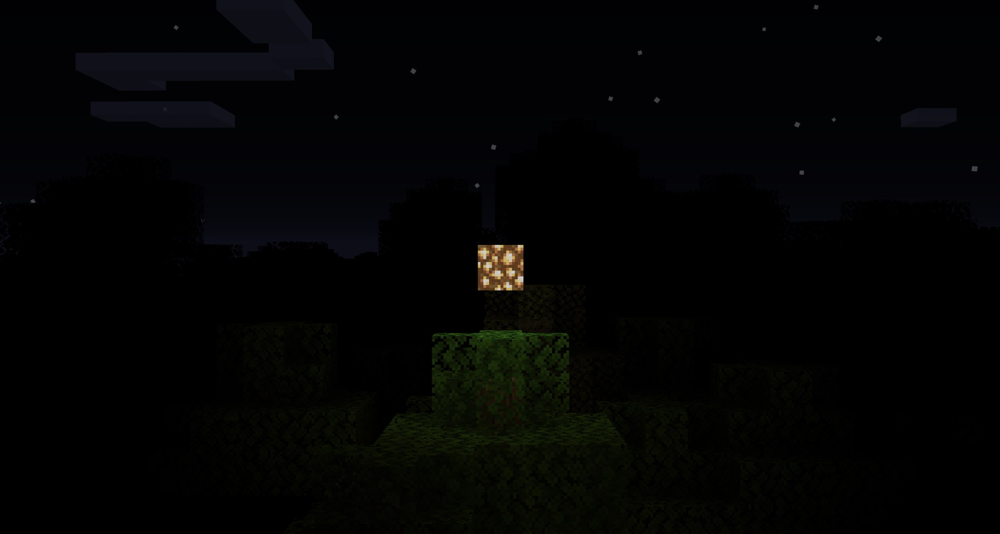

# Pitch Darkness
Makes any block of light level 0 render as completely black rather than mildly illuminated;  
essentially the [Hardcore Darkness mod](https://www.curseforge.com/minecraft/mc-mods/hardcore-darkness).

# [Download](https://github.com/jadc/pitch-packs/releases)

  
Here is vanilla darkness for comparison.

Other dimensions work too.

