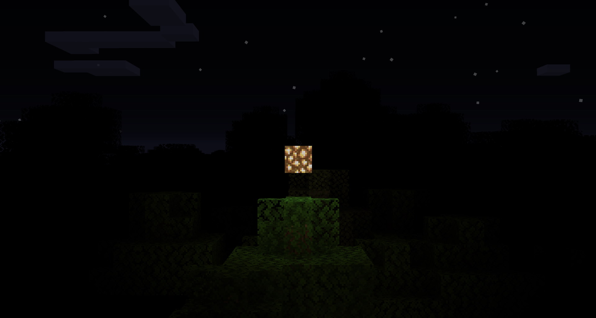
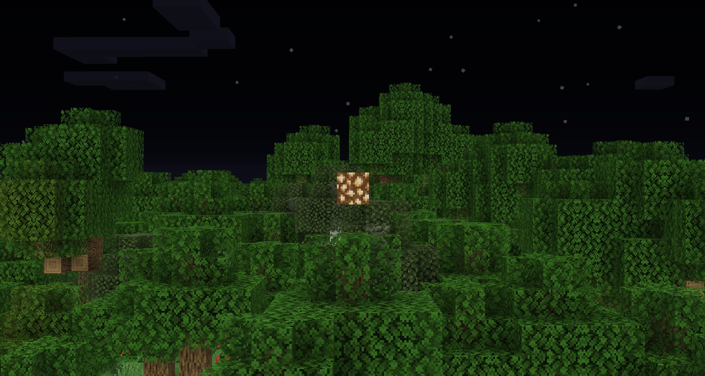
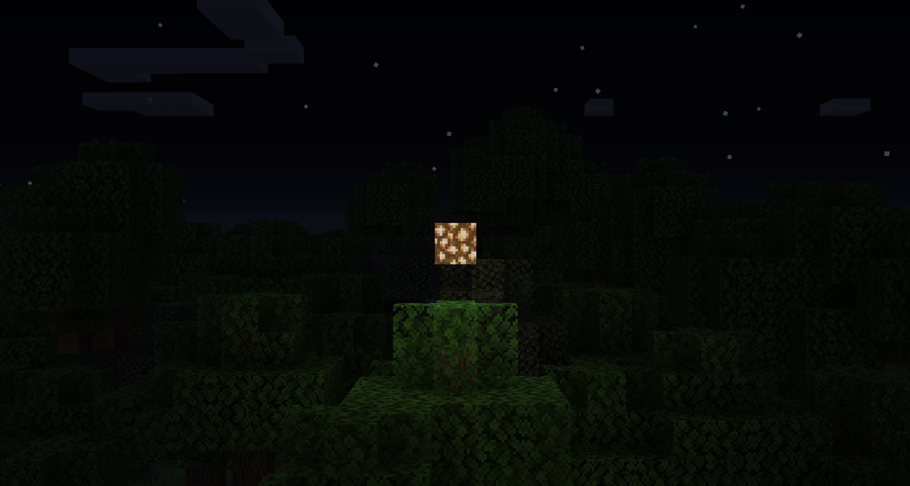

# pitch-packs
Minecraft resource packs that modify the lightmap of the game.  
Both these packs require the installation of [OptiFine](https://optifine.net).

There are two packs.
## Pitch Darkness
  Makes any block of light level 0 render as completely black rather than mildly illuminated; essentially the [Hardcore Darkness mod](https://www.curseforge.com/minecraft/mc-mods/hardcore-darkness).

## Pitch Brightness  
Makes any block of any light level render as light level 15, which is fullbright.

Here is a vanilla screenshot for comparison.

# Downloads
Both packs can be downloaded from the [releases page](https://github.com/jadc/pitch-packs/releases).
